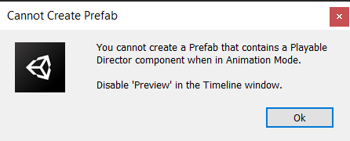
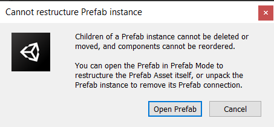
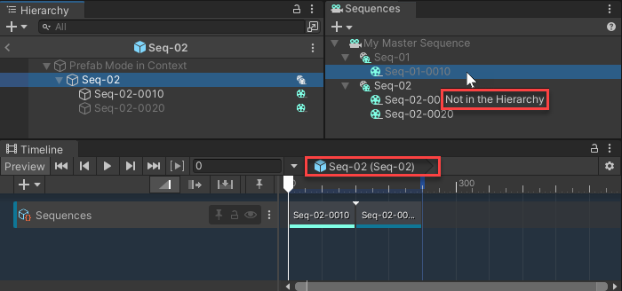

# Managing Sequences as Prefabs

[!INCLUDE [banner-message](banner-message.md)]

Unity doesn't prevent you from converting a [Sequence GameObject](under-the-hood.md#sequence-gameobjects) of your [Editorial structure](concepts.md#editorial-structure) into a [Prefab](https://docs.unity3d.com/Manual/Prefabs.html). However, this choice comes with a few side effects you should be aware of, mostly because of the inherent characteristics and behaviors of Prefabs in Unity.

## Understanding the Prefab flow in Sequences

### Prefab instance and Prefab asset

Once you convert a Sequence GameObject into a Prefab, you have two distinct items to be aware of when performing common tasks with Sequences:
* In your Scene Hierarchy, a Prefab instance, in place of the original Sequence GameObject.
* In your Project window, a Prefab Asset resulting from the conversion.

From the Sequences perspective:
* The Prefab instance (in the Scene) always remains the one that drives the status and behavior of the Sequence in the Sequences window and the Timeline window.
* The Prefab Asset (in the Project) acts as a copy of the Sequence with all its structure and content, outside of its Editorial context.

### Prefab behaviors in Sequences workflow

In Unity, Prefabs and GameObjects have inherently different behaviors. As soon as you convert a Sequence GameObject into a Prefab, it might impact your Sequences workflow. Overall, you should be aware of the following aspects when you work through the Sequences main windows:

* When you _add new content_ to a prefab-converted Sequence, the changes only apply locally to the Scene. Then, if you want to keep the Prefab Asset synchronized with the Prefab instance, you might need to regularly [apply overrides](https://docs.unity3d.com/Manual/EditingPrefabViaInstance.html) from the Prefab instance to the Prefab Asset.
* When you want to _edit the existing content_ of a prefab-converted Sequence, Unity prevents you from doing it through the Prefab instance. You have to enter the [Prefab Mode](https://docs.unity3d.com/Manual/EditingInPrefabMode.html) and make your edits directly in the Prefab Asset.

>**Note:** If you're editing content that is still new to the Prefab instance, which means you didn't apply the overrides to the Prefab Asset for this content yet, you don't have to enter the Prefab Mode, because this content doesn't exist in the Prefab Asset in that case.

## Converting a Sequence GameObject into a Prefab

To convert a Sequence GameObject into a Prefab, follow the [same process](https://docs.unity3d.com/Manual/CreatingPrefabs.html) as for any other GameObject. However, you first have to disable the [Preview mode](https://docs.unity3d.com/Packages/com.unity.timeline@1.6/manual/tl_selector.html) in the Timeline window to be able to do it. Unity warns you if you didn't disable the Preview mode:

## Editing a Sequence already converted into a Prefab

### Renaming the Sequence
Currently, you can’t rename a Prefab-converted Sequence directly from the Sequences window. However, you can [work around this issue](known-issues.md) through manual actions depending on your actual needs.

### Adding content to the Sequence
Once you’ve converted a Sequence GameObject into a Prefab, you can still use the Sequences and Sequence Assembly windows to add sub-sequences or Sequence Assets to it. You can also freely rename its existing sub-sequences.

Once you’re done, don’t forget to [apply overrides](https://docs.unity3d.com/Manual/EditingPrefabViaInstance.html) from the instantiated Prefab of the Scene’s Hierarchy to the Prefab Asset of your Project if you want to keep them synchronized.

### Editing or removing Sequence content
If you just added any content to the Sequence and you didn’t apply the corresponding overrides yet to its Prefab Asset, you can freely edit, swap, or remove this content.

Conversely, if you need to edit, swap, or remove any Sequence content for which you already applied overrides, you must first open the Sequence in [Prefab Mode](https://docs.unity3d.com/Manual/EditingInPrefabMode.html).

>**Note:** If you try to perform such actions from the Sequences and Sequence Assembly windows, Unity doesn’t process your action and warns you about the Prefab Mode requirement.
>
>
>
>Then, once you open the Sequence Prefab in Prefab Mode, you must re-attempt the action you initially tried to perform, but you can continue to edit the Sequence content normally.

Once you’re done with your Sequence content changes, save the Prefab and exit the Prefab Mode.

## Navigating through the Editorial structure when in Prefab Mode

When you open a Sequence Prefab in [Prefab Mode](https://docs.unity3d.com/Manual/EditingInPrefabMode.html), the Sequences window and the Timeline window only allow you to navigate through the content of this Sequence. This is to maintain consistency with the treeview the Hierarchy displays.

If you need to access the Sequence parent levels, you must exit the Prefab Mode.

| Example: Sequence Prefab "Seq-02" open in Prefab Mode |
| :--- |
|  |
| In the Sequences window, any Sequences outside Seq-02 are identified as "Not in the Hierarchy" and you can't edit them or access their content. |
| In the Timeline window, the breadcrumb top level is Seq-02, which prevents you from navigating through the timeline of the whole master sequence. |
